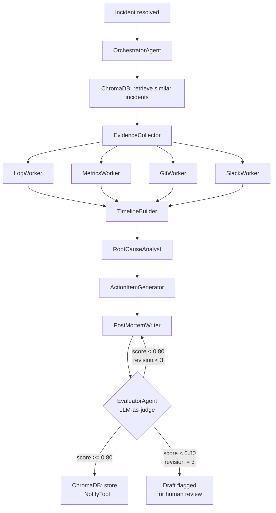

# retro-pilot

> ops-pilot catches the failure. retro-pilot learns from it.

**Built by [Adnan Khan](https://adnankhan.me)** — Sr. Director of AI Engineering · [LinkedIn](https://linkedin.com/in/passionateforinnovation) · [Portfolio](https://adnankhan.me)

---

retro-pilot is an autonomous incident post-mortem system. It collects evidence, reconstructs timelines, performs root cause analysis, and generates structured post-mortems — automatically, after every resolved incident. Post-mortems are stored in a semantic vector database so future incidents can learn from past ones.

**Part of a two-project series with [ops-pilot](https://github.com/adnanafik/ops-pilot)** — ops-pilot responds to CI/CD failures in real time; retro-pilot learns from them after the fact.

→ **[Live demo](https://adnanafik.github.io/retro-pilot)**


---

## How it works



---

## How it's different from ops-pilot

| | ops-pilot | retro-pilot |
|---|---|---|
| **When it runs** | Real-time (CI failure webhook) | After incident resolution |
| **Orchestration** | Sequential pipeline | Hierarchical — Orchestrator spawns specialists |
| **Evaluation** | Rule-based triage | LLM-as-judge revision loop |
| **Memory** | Token Jaccard similarity | ChromaDB semantic embeddings |
| **Output** | Fix PR + Slack alert | Post-mortem document + knowledge base entry |

### Hierarchical orchestration
The OrchestratorAgent coordinates 6 specialist agents in sequence, passing typed Pydantic models between them. No raw dicts cross agent boundaries. Evidence workers are isolated — LogWorker can't query metrics; MetricsWorker can't read Slack.

### LLM-as-judge evaluation loop
Every draft post-mortem is scored against a 5-dimension rubric (timeline completeness, root cause clarity, action item quality, executive summary clarity, similar incidents referenced). If the score is below 0.80, a specific revision brief is generated and the PostMortemWriter revises. Maximum 3 cycles — unbounded loops are a production risk.

### Semantic vector store
Post-mortems are embedded with sentence-transformers (all-MiniLM-L6-v2) and stored in ChromaDB. "Redis connection pool exhaustion" and "connection pool timeout" match even though they share no tokens. ops-pilot's token Jaccard works well for structured CI failure data; post-mortems are prose-heavy and need semantic similarity.

---

## Knowledge base

Every post-mortem that passes evaluation is stored in ChromaDB:

- **Document**: `{title} {executive_summary} {root_cause.primary} {contributing_factors} {lessons_learned}`
- **Metadata**: incident_id, severity, affected_services, duration, action_item_count
- **Retrieval**: top-3 by cosine similarity > 0.65
- **Weekly consolidation**: incidents with similarity > 0.90 are merged into pattern records — signals systemic problems, not one-off incidents

---

## Run locally in 3 commands

```bash
git clone https://github.com/adnanafik/retro-pilot
cd retro-pilot
docker compose run --rm test                     # run test suite
DEMO_MODE=true uvicorn demo.app:app --port 8000  # start demo server
```

Open http://localhost:8000.

### Demo UI

The demo has two tabs:

**Pipeline** — select one of three pre-recorded scenarios (Redis cascade SEV1, deploy regression SEV2, certificate expiry SEV2) and watch the agent pipeline run: evidence collection, timeline reconstruction, root cause analysis, action item generation, post-mortem assembly, and evaluator scoring with a revision cycle.

**Review** — browse the generated post-mortems, inspect evaluator score breakdowns, and record approvals, change requests, or rejections with your name. Review actions persist server-side. This tab requires the FastAPI backend and is not available in the GitHub Pages static demo.

### Live mode

Requires `ANTHROPIC_API_KEY`. Triggers real agent execution against a live incident:

```bash
python scripts/run_postmortem.py \
  --incident-id INC-2026-0001 \
  --title "Redis pool exhaustion" \
  --severity SEV1 \
  --started-at 2026-01-15T14:00:00Z \
  --resolved-at 2026-01-15T14:47:00Z \
  --services auth-service payment-service \
  --slack-channel "#incidents" \
  --reported-by oncall
```

---

## Production deployment

### Environment variables

| Variable | Required | Description |
|----------|----------|-------------|
| `ANTHROPIC_API_KEY` | Yes | Claude API key for all agent LLM calls |
| `DEMO_MODE` | No (default `false`) | Set `true` to serve pre-recorded scenarios with no API calls |
| `GITHUB_TOKEN` | No | Personal access token for `GetGitHistoryTool` — read:repo scope |
| `SLACK_BOT_TOKEN` | No | Bot token for `GetSlackThreadTool` — `channels:history` scope |

Create a `.env` file (never commit it):

```bash
ANTHROPIC_API_KEY=sk-ant-...
GITHUB_TOKEN=ghp_...
SLACK_BOT_TOKEN=xoxb-...
DEMO_MODE=false
```

### Docker Compose

```bash
docker compose up -d retro-pilot-demo
```

The `chroma_db/` directory is volume-mounted at `./chroma_db` — this is where ChromaDB persists post-mortems across restarts. Back it up if it matters.

### Configuration

Copy the example config and edit for your environment:

```bash
cp retro-pilot.example.yml retro-pilot.yml
```

Key settings in `retro-pilot.yml`:

```yaml
evaluator:
  pass_threshold: 0.80      # minimum score to accept a post-mortem
  max_revision_cycles: 3    # hard cap on LLM revision loops

knowledge:
  similarity_threshold: 0.65   # minimum cosine similarity to surface a past incident
  top_k: 3                     # how many similar incidents to retrieve

tools:
  logs:
    endpoint: "https://logs.internal/api"   # your log aggregation API
  metrics:
    endpoint: "https://metrics.internal"    # CloudWatch / Datadog / etc.
```

### Triggering post-mortems automatically

The intended production pattern is to call `scripts/run_postmortem.py` from your incident management system when an incident is resolved — e.g. a PagerDuty webhook, an ops-pilot post-resolution hook, or a Slack slash command.

All output is `draft=True` until a human approves it in the Review tab. Nothing is published or distributed without explicit review.

---

## Design decisions

### Why a revision loop with a maximum of 3 cycles?
Unbounded revision loops are a production risk — a bad rubric or a confused model can loop indefinitely. 3 cycles is enough to catch structural issues (missing acceptance criteria, vague root cause) without risking runaway LLM costs. After 3 cycles, the best draft is saved with `draft=True` and flagged for human review. The limit is configurable in `retro-pilot.yml`.

### Why LLM-as-judge instead of rule-based validation?
Rule-based validation catches structural issues — Pydantic handles those. LLM-as-judge catches semantic issues: a root cause that is technically present but too vague to act on, an acceptance criteria that doesn't describe a measurable outcome, an executive summary that a VP couldn't understand. These require judgment, not schema validation.

### Why ChromaDB over ops-pilot's token Jaccard similarity?
ops-pilot's weighted token overlap works well for structured CI failure data with constrained vocabulary. Post-mortems are prose-heavy — "cascading Redis timeout" and "connection pool exhaustion" should match even though they share no tokens. ChromaDB is local and persistent (no external API). sentence-transformers runs on CPU without GPU requirements. all-MiniLM-L6-v2 is 80MB — deployable anywhere.

### Why isolate evidence workers from each other?
Each worker (Log, Metrics, Git, Slack) has a scoped READ-ONLY tool list. LogWorker cannot query metrics; MetricsWorker cannot read Slack. Two benefits: workers stay focused; the orchestrator receives clean typed summaries, not interleaved raw tool output. Workers cannot spawn further workers — no unbounded recursion.

---

## Project structure

```
retro-pilot/
├── agents/          # OrchestratorAgent + 6 specialist agents + EvaluatorAgent
├── tools/           # ToolRegistry, read tools, write tools
├── knowledge/       # ChromaDB vector store, sentence-transformers embedder, consolidator
├── evaluator/       # Scoring rubric and scorer (deterministic, no LLM)
├── shared/          # Pydantic models, config, context budget, trust/tenant context
├── demo/            # FastAPI SSE server + vanilla JS UI + 3 pre-recorded scenarios
├── docs/            # GitHub Pages static demo
├── scripts/         # CLI entry point
└── tests/           # pytest suite (>=85% coverage on agents + evaluator)
```

---

## License

MIT
