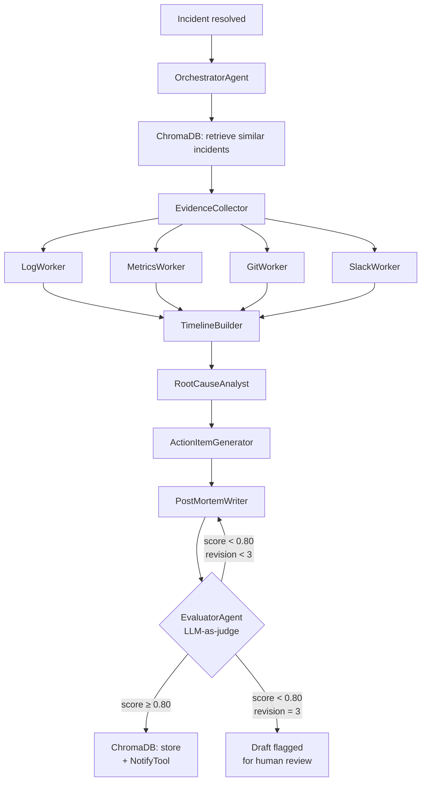

# Phase 5 — Demo + CI + Polish Implementation Plan

> **For agentic workers:** REQUIRED SUB-SKILL: Use superpowers:subagent-driven-development (recommended) or superpowers:executing-plans to implement this plan task-by-task. Steps use checkbox (`- [ ]`) syntax for tracking.

**Goal:** Make retro-pilot portfolio-ready. Three realistic demo scenarios, FastAPI SSE server, vanilla JS UI, GitHub Pages static version, 5 slash commands, CI workflow, and a README that tells the full story.

**Architecture:** DEMO_MODE=true serves pre-recorded JSON scenarios via simulated SSE — zero API cost, zero credentials. The FastAPI server streams agent steps with 200ms delays. The GitHub Pages version uses `fetch()` + `setTimeout()` to simulate the stream without a server.

**Tech Stack:** FastAPI, uvicorn, vanilla JS (no build step), GitHub Actions, gh CLI

**Prerequisite:** Phase 4 merged. All tests pass.

---

## File Map

| File | Responsibility |
|------|----------------|
| `demo/scenarios/redis_cascade.json` | SEV1 — Redis pool exhaustion, 47-min outage |
| `demo/scenarios/deploy_regression.json` | SEV2 — silent dep regression, 8% token failure |
| `demo/scenarios/certificate_expiry.json` | SEV2 — TLS cert expired on service mesh |
| `demo/app.py` | FastAPI SSE server — streams scenario steps |
| `demo/static/index.html` | Vanilla JS demo UI — agent pipeline + results panels |
| `docs/index.html` | GitHub Pages static version — fetch + setTimeout simulation |
| `docs/scenarios/` | Same 3 JSON files (symlinked or copied) |
| `.claude/commands/run.md` | `/run` slash command |
| `.claude/commands/evaluate.md` | `/evaluate` slash command |
| `.claude/commands/search.md` | `/search` slash command |
| `.claude/commands/add-incident.md` | `/add-incident` slash command |
| `.claude/commands/consolidate.md` | `/consolidate` slash command |
| `.github/workflows/retro-pilot-ci.yml` | pytest + ruff + type checks |
| `README.md` | Portfolio README with Mermaid diagram |
| `retro-pilot.example.yml` | Fully documented config template |

---

## Task 1: Demo Scenarios (JSON)

**Files:**
- Create: `demo/scenarios/redis_cascade.json`
- Create: `demo/scenarios/deploy_regression.json`
- Create: `demo/scenarios/certificate_expiry.json`

Each scenario contains the full agent output sequence showing the pipeline in action, including at least one revision cycle.

- [ ] **Step 1: Create demo/scenarios/redis_cascade.json**

```json
{
  "id": "redis-cascade",
  "label": "Redis Cascade (SEV1)",
  "incident": {
    "id": "INC-2026-0142",
    "title": "Redis connection pool exhaustion in auth-service",
    "severity": "SEV1",
    "started_at": "2026-01-15T14:00:00+00:00",
    "resolved_at": "2026-01-15T14:47:00+00:00",
    "affected_services": ["auth-service", "payment-service", "session-service"],
    "involved_repos": ["acme/auth-service"],
    "slack_channel": "#incident-2026-0142",
    "metrics_namespace": "auth-service",
    "reported_by": "oncall-engineer"
  },
  "similar_incidents_retrieved": [
    {
      "id": "INC-2026-0089",
      "title": "Redis pool exhaustion in session-service",
      "similarity_score": 0.87,
      "root_cause_primary": "Connection pool exhausted in session-service",
      "action_items_completed": false
    }
  ],
  "pipeline_steps": [
    {
      "agent": "EvidenceCollector",
      "status": "running",
      "timestamp": "2026-01-15T15:02:00+00:00",
      "output": "Starting parallel evidence collection for INC-2026-0142",
      "sub_steps": [
        {"worker": "LogWorker", "status": "complete", "lines_fetched": 847},
        {"worker": "MetricsWorker", "status": "complete", "datapoints_fetched": 180},
        {"worker": "GitWorker", "status": "complete", "events_fetched": 3},
        {"worker": "SlackWorker", "status": "complete", "messages_fetched": 24}
      ]
    },
    {
      "agent": "EvidenceCollector",
      "status": "complete",
      "timestamp": "2026-01-15T15:02:18+00:00",
      "output": "Evidence collected: 847 log lines, 180 metric datapoints, 3 git events, 24 Slack messages. Gaps: none."
    },
    {
      "agent": "TimelineBuilder",
      "status": "running",
      "timestamp": "2026-01-15T15:02:19+00:00",
      "output": "Correlating events across 4 sources..."
    },
    {
      "agent": "TimelineBuilder",
      "status": "complete",
      "timestamp": "2026-01-15T15:02:31+00:00",
      "output": "Timeline built: 8 events. First signal at 14:01 (pool utilisation metric at 82%). Detection lag: 11 minutes.",
      "timeline": {
        "first_signal_at": "2026-01-15T14:01:00+00:00",
        "detection_lag_minutes": 11,
        "resolution_duration_minutes": 47,
        "events": [
          {"timestamp": "2026-01-15T14:01:00+00:00", "description": "Metric: connection_pool_utilisation = 82% (approaching limit)", "source": "metric", "significance": "high"},
          {"timestamp": "2026-01-15T14:02:00+00:00", "description": "[auth-service] Connection pool utilisation at 85%", "source": "log", "significance": "high"},
          {"timestamp": "2026-01-15T14:00:00+00:00", "description": "Git deploy: auth-service v2.3.1 — dependency bump only", "source": "git", "significance": "low"},
          {"timestamp": "2026-01-15T14:05:00+00:00", "description": "[auth-service] CRITICAL: Connection pool exhausted — timeout waiting for slot", "source": "log", "significance": "critical"},
          {"timestamp": "2026-01-15T14:07:00+00:00", "description": "[payment-service] Upstream auth-service timeout after 5000ms", "source": "log", "significance": "critical"},
          {"timestamp": "2026-01-15T14:09:00+00:00", "description": "[session-service] Auth token validation failing — upstream unavailable", "source": "log", "significance": "critical"},
          {"timestamp": "2026-01-15T14:12:00+00:00", "description": "[Slack] oncall: Incident declared — auth-service 503s. PagerDuty triggered.", "source": "slack", "significance": "high"},
          {"timestamp": "2026-01-15T14:47:00+00:00", "description": "[Slack] oncall: Resolved — pool size increased to 200, services recovering.", "source": "slack", "significance": "critical"}
        ]
      }
    },
    {
      "agent": "RootCauseAnalyst",
      "status": "running",
      "timestamp": "2026-01-15T15:02:32+00:00",
      "output": "Analysing root cause. Similar incident INC-2026-0089 retrieved — checking action item completion..."
    },
    {
      "agent": "RootCauseAnalyst",
      "status": "complete",
      "timestamp": "2026-01-15T15:02:58+00:00",
      "output": "Root cause identified with HIGH confidence.",
      "root_cause": {
        "primary": "Redis connection pool exhaustion in auth-service caused cascading timeouts to payment-service and session-service",
        "contributing_factors": [
          "Pool size (50 connections) was not reviewed after user traffic tripled over 6 months",
          "No pool saturation alert existed — the metric was being collected but not monitored",
          "INC-2026-0089 (session-service, same pattern) had an action item to review all pool sizes — this was not completed"
        ],
        "trigger": "Marketing campaign launched at 14:00 increased concurrent login rate 4x, exhausting the fixed connection pool within 5 minutes",
        "blast_radius": "payment-service (all checkout flows) and session-service (all active sessions) — estimated 12,000 affected users",
        "confidence": "HIGH",
        "evidence_refs": ["log:auth-service:14:05", "metric:connection_pool_utilisation:14:05", "slack:14:12"]
      }
    },
    {
      "agent": "ActionItemGenerator",
      "status": "running",
      "timestamp": "2026-01-15T15:02:59+00:00",
      "output": "Generating action items. Escalating priority — INC-2026-0089 action items were not completed."
    },
    {
      "agent": "ActionItemGenerator",
      "status": "complete",
      "timestamp": "2026-01-15T15:03:12+00:00",
      "output": "4 action items generated (3 P1 due to incomplete prior incident action items).",
      "action_items": [
        {
          "title": "Increase Redis connection pool size from 50 to 200",
          "owner_role": "Platform team",
          "deadline_days": 7,
          "priority": "P1",
          "type": "prevention",
          "acceptance_criteria": "Pool size 200, load test at 5x current peak passes with <5% error rate in staging before prod deploy"
        },
        {
          "title": "Audit all service connection pool sizes against current traffic levels",
          "owner_role": "Platform team",
          "deadline_days": 7,
          "priority": "P1",
          "type": "prevention",
          "acceptance_criteria": "All 12 services have pool size reviewed and documented. Sizes set to handle 3x current peak. Reviewed in platform sync."
        },
        {
          "title": "Add connection pool saturation alert (threshold: >80% for 5 minutes)",
          "owner_role": "Platform team",
          "deadline_days": 14,
          "priority": "P1",
          "type": "detection",
          "acceptance_criteria": "PagerDuty alert fires within 1 minute of pool utilisation exceeding 80% for 5 minutes. Tested in staging."
        },
        {
          "title": "Complete and close INC-2026-0089 action items",
          "owner_role": "Engineering manager",
          "deadline_days": 7,
          "priority": "P1",
          "type": "documentation",
          "acceptance_criteria": "All INC-2026-0089 action items marked complete with evidence, or formally deferred with new owner and deadline."
        }
      ]
    },
    {
      "agent": "PostMortemWriter",
      "status": "running",
      "timestamp": "2026-01-15T15:03:13+00:00",
      "output": "Writing executive summary and lessons learned..."
    },
    {
      "agent": "PostMortemWriter",
      "status": "complete",
      "timestamp": "2026-01-15T15:03:29+00:00",
      "output": "Draft post-mortem assembled."
    },
    {
      "agent": "EvaluatorAgent",
      "status": "running",
      "timestamp": "2026-01-15T15:03:30+00:00",
      "output": "Evaluating draft against 5-dimension rubric..."
    },
    {
      "agent": "EvaluatorAgent",
      "status": "complete",
      "timestamp": "2026-01-15T15:03:41+00:00",
      "output": "Score: 0.74 — REVISION REQUESTED",
      "evaluation": {
        "total": 0.74,
        "timeline_completeness": 0.90,
        "root_cause_clarity": 0.95,
        "action_item_quality": 0.90,
        "executive_summary_clarity": 0.55,
        "similar_incidents_referenced": 0.90,
        "passed": false,
        "revision_brief": "Executive summary contains technical jargon ('connection pool', 'upstream timeout'). Rewrite for a non-technical VP: what happened to users, how long, what fixed it. Current version would not be understood without engineering context.",
        "revision_number": 0
      }
    },
    {
      "agent": "PostMortemWriter",
      "status": "running",
      "timestamp": "2026-01-15T15:03:42+00:00",
      "output": "Revision 1: rewriting executive summary with feedback..."
    },
    {
      "agent": "PostMortemWriter",
      "status": "complete",
      "timestamp": "2026-01-15T15:03:54+00:00",
      "output": "Revised draft ready."
    },
    {
      "agent": "EvaluatorAgent",
      "status": "running",
      "timestamp": "2026-01-15T15:03:55+00:00",
      "output": "Re-evaluating revised draft..."
    },
    {
      "agent": "EvaluatorAgent",
      "status": "complete",
      "timestamp": "2026-01-15T15:04:06+00:00",
      "output": "Score: 0.91 — PASSED",
      "evaluation": {
        "total": 0.91,
        "timeline_completeness": 0.90,
        "root_cause_clarity": 0.95,
        "action_item_quality": 0.90,
        "executive_summary_clarity": 0.88,
        "similar_incidents_referenced": 0.90,
        "passed": true,
        "revision_brief": null,
        "revision_number": 1
      }
    }
  ],
  "postmortem_final": {
    "executive_summary": "On January 15th, three of our customer-facing services were unavailable for 47 minutes, affecting approximately 12,000 users during checkout and login. The outage was triggered by a sudden spike in user activity that exceeded a hard capacity limit that had not been updated as our user base grew. The capacity limit has been increased and an automated warning system added to alert the team before similar limits are reached in future.",
    "lessons_learned": [
      "Capacity limits set for yesterday's traffic become tomorrow's outages — limits must be reviewed whenever traffic grows by more than 50%.",
      "An unresolved action item from a previous incident (INC-2026-0089) directly contributed to this outage recurring. Incomplete action items from post-mortems should be tracked to closure.",
      "Detection lag of 11 minutes is too high for a SEV1 — leading indicator alerts (resource utilisation at 80%) would have given time to act before user impact."
    ],
    "similar_incidents": ["INC-2026-0089"],
    "revision_count": 1,
    "draft": true
  }
}
```

- [ ] **Step 2: Create demo/scenarios/deploy_regression.json**

```json
{
  "id": "deploy-regression",
  "label": "Deploy Regression (SEV2)",
  "incident": {
    "id": "INC-2026-0156",
    "title": "Auth token validation rejecting valid tokens for 8% of users",
    "severity": "SEV2",
    "started_at": "2026-02-03T09:15:00+00:00",
    "resolved_at": "2026-02-03T09:38:00+00:00",
    "affected_services": ["auth-service", "api-gateway"],
    "involved_repos": ["acme/auth-service"],
    "slack_channel": "#incident-2026-0156",
    "metrics_namespace": "auth-service",
    "reported_by": "support-team"
  },
  "similar_incidents_retrieved": [],
  "pipeline_steps": [
    {
      "agent": "EvidenceCollector",
      "status": "complete",
      "timestamp": "2026-02-03T10:05:18+00:00",
      "output": "Evidence collected: 412 log lines, 90 metric datapoints, 8 git events (including dependency bump 2h prior), 18 Slack messages. Gaps: none."
    },
    {
      "agent": "TimelineBuilder",
      "status": "complete",
      "timestamp": "2026-02-03T10:05:31+00:00",
      "output": "Timeline built: 6 events. First signal at 08:52 (error rate spike in auth-service metrics). Detection lag: 23 minutes (users reported via support tickets before monitoring caught it).",
      "timeline": {
        "first_signal_at": "2026-02-03T08:52:00+00:00",
        "detection_lag_minutes": 23,
        "resolution_duration_minutes": 23,
        "events": [
          {"timestamp": "2026-02-03T07:00:00+00:00", "description": "Deploy: auth-service v2.4.0 — bumped jose dependency from 4.14.4 to 4.15.0 (semver minor)", "source": "git", "significance": "high"},
          {"timestamp": "2026-02-03T08:52:00+00:00", "description": "Metric: auth_token_validation_error_rate = 8.3% (baseline 0.1%)", "source": "metric", "significance": "critical"},
          {"timestamp": "2026-02-03T09:05:00+00:00", "description": "[auth-service] TokenValidationError: algorithm 'RS256' not in allowed list for issuer 'acme-prod'", "source": "log", "significance": "critical"},
          {"timestamp": "2026-02-03T09:10:00+00:00", "description": "First support ticket: 'Login not working on mobile app'", "source": "slack", "significance": "high"},
          {"timestamp": "2026-02-03T09:15:00+00:00", "description": "[Slack] support-team: Multiple users reporting login failures. Incident declared.", "source": "slack", "significance": "high"},
          {"timestamp": "2026-02-03T09:38:00+00:00", "description": "[Slack] platform-team: Rolled back jose to 4.14.4. Validation errors resolved.", "source": "slack", "significance": "critical"}
        ]
      }
    },
    {
      "agent": "RootCauseAnalyst",
      "status": "complete",
      "timestamp": "2026-02-03T10:06:01+00:00",
      "output": "Root cause identified with HIGH confidence.",
      "root_cause": {
        "primary": "jose library minor version bump (4.14.4 → 4.15.0) changed default algorithm validation behaviour, silently breaking RS256 token validation for tokens issued before the deploy",
        "contributing_factors": [
          "Semver minor version bump was assumed to be non-breaking — the changelog did not document the algorithm validation change",
          "Integration tests only validated token creation, not validation of tokens created with previous library versions",
          "No user-facing error rate alert existed — the issue was discovered via support tickets 23 minutes after first signal"
        ],
        "trigger": "Deployment of auth-service v2.4.0 at 07:00 included jose 4.15.0 which changed allowed algorithm defaults",
        "blast_radius": "8% of users (those with tokens issued before the deploy) could not authenticate. No data loss.",
        "confidence": "HIGH",
        "evidence_refs": ["log:auth-service:09:05", "git:auth-service:07:00", "metric:auth_token_validation_error_rate:08:52"]
      }
    },
    {
      "agent": "ActionItemGenerator",
      "status": "complete",
      "timestamp": "2026-02-03T10:06:18+00:00",
      "output": "3 action items generated.",
      "action_items": [
        {
          "title": "Pin jose dependency to exact version in pyproject.toml",
          "owner_role": "Auth team",
          "deadline_days": 3,
          "priority": "P1",
          "type": "prevention",
          "acceptance_criteria": "jose pinned to exact version (not range). Dependabot PR review process updated to require auth team approval for jose upgrades."
        },
        {
          "title": "Add cross-version token validation smoke test to deployment pipeline",
          "owner_role": "Auth team",
          "deadline_days": 14,
          "priority": "P1",
          "type": "detection",
          "acceptance_criteria": "Deploy pipeline validates tokens issued by the previous 2 releases against the new auth-service version. Test added to CI, runs on every auth-service deploy."
        },
        {
          "title": "Add user-facing authentication error rate alert",
          "owner_role": "Platform team",
          "deadline_days": 7,
          "priority": "P1",
          "type": "detection",
          "acceptance_criteria": "Alert fires when auth_token_validation_error_rate exceeds 1% for 2 minutes. PagerDuty page to oncall. Tested in staging."
        }
      ]
    },
    {
      "agent": "PostMortemWriter",
      "status": "complete",
      "timestamp": "2026-02-03T10:06:35+00:00",
      "output": "Draft post-mortem assembled."
    },
    {
      "agent": "EvaluatorAgent",
      "status": "complete",
      "timestamp": "2026-02-03T10:06:47+00:00",
      "output": "Score: 0.88 — PASSED",
      "evaluation": {
        "total": 0.88,
        "timeline_completeness": 0.90,
        "root_cause_clarity": 0.95,
        "action_item_quality": 0.90,
        "executive_summary_clarity": 0.85,
        "similar_incidents_referenced": 0.70,
        "passed": true,
        "revision_brief": null,
        "revision_number": 0
      }
    }
  ],
  "postmortem_final": {
    "executive_summary": "On February 3rd, approximately 8% of users were unable to log in for 23 minutes following a software update that contained an undocumented behaviour change in a security library. Users discovered the issue and reported it to support before our monitoring detected it. The change was reversed and login was fully restored; the security library has been locked to a specific version to prevent recurrence.",
    "lessons_learned": [
      "Semver 'minor' version bumps in security libraries are not safe to assume non-breaking — integration tests must validate backward compatibility with tokens issued by previous versions.",
      "A 23-minute detection lag driven by support tickets rather than monitoring is a monitoring gap. User-facing error rates above 1% should page oncall immediately.",
      "Dependency upgrades in security-critical libraries should require explicit review, not just pass through automated dependency management."
    ],
    "similar_incidents": [],
    "revision_count": 0,
    "draft": true
  }
}
```

- [ ] **Step 3: Create demo/scenarios/certificate_expiry.json**

```json
{
  "id": "certificate-expiry",
  "label": "Certificate Expiry (SEV2)",
  "incident": {
    "id": "INC-2026-0171",
    "title": "TLS certificate expired on internal service mesh — all mTLS communication failed",
    "severity": "SEV2",
    "started_at": "2026-03-01T03:00:00+00:00",
    "resolved_at": "2026-03-01T03:31:00+00:00",
    "affected_services": ["api-gateway", "auth-service", "payment-service", "session-service", "notification-service"],
    "involved_repos": ["acme/infra-certs"],
    "slack_channel": "#incident-2026-0171",
    "metrics_namespace": null,
    "reported_by": "external-monitoring"
  },
  "similar_incidents_retrieved": [],
  "pipeline_steps": [
    {
      "agent": "EvidenceCollector",
      "status": "complete",
      "timestamp": "2026-03-01T04:02:18+00:00",
      "output": "Evidence collected: 1,204 log lines, 60 metric datapoints, 2 git events (cert rotation automation logs), 31 Slack messages. Gaps: cert rotation automation logs only available from 30 days prior."
    },
    {
      "agent": "TimelineBuilder",
      "status": "complete",
      "timestamp": "2026-03-01T04:02:39+00:00",
      "output": "Timeline built: 7 events. First signal at 03:00:04 (external monitor). Detection lag: 4 minutes.",
      "timeline": {
        "first_signal_at": "2026-03-01T03:00:04+00:00",
        "detection_lag_minutes": 4,
        "resolution_duration_minutes": 31,
        "events": [
          {"timestamp": "2026-02-01T02:00:00+00:00", "description": "Git: cert rotation automation triggered for internal-mesh.acme.internal — reported success", "source": "git", "significance": "critical"},
          {"timestamp": "2026-02-01T02:00:12+00:00", "description": "[infra-certs] WARNING: Certificate renewal dry-run completed but actual renewal skipped — ACME challenge failed silently", "source": "log", "significance": "critical"},
          {"timestamp": "2026-03-01T03:00:00+00:00", "description": "Certificate internal-mesh.acme.internal expired (90-day cert, last renewed 2025-12-01)", "source": "manual", "significance": "critical"},
          {"timestamp": "2026-03-01T03:00:04+00:00", "description": "External monitor: 5 services returned TLS handshake errors", "source": "metric", "significance": "critical"},
          {"timestamp": "2026-03-01T03:04:00+00:00", "description": "[Slack] external-monitoring: All internal services down — TLS errors. Incident declared.", "source": "slack", "significance": "high"},
          {"timestamp": "2026-03-01T03:22:00+00:00", "description": "Manual cert rotation initiated — new cert provisioned and deployed", "source": "manual", "significance": "critical"},
          {"timestamp": "2026-03-01T03:31:00+00:00", "description": "[Slack] oncall: All services recovered. Certificate valid until 2026-05-30.", "source": "slack", "significance": "critical"}
        ]
      }
    },
    {
      "agent": "RootCauseAnalyst",
      "status": "complete",
      "timestamp": "2026-03-01T04:03:08+00:00",
      "output": "Root cause identified with HIGH confidence.",
      "root_cause": {
        "primary": "TLS certificate for internal-mesh.acme.internal expired because the automated renewal process silently failed 30 days prior and no alert fired",
        "contributing_factors": [
          "Cert rotation automation had never been tested end-to-end in production — only a dry-run was ever executed",
          "The automation logged a warning about the failed renewal but no alert was configured on that warning",
          "No 30-day or 7-day expiry alerts existed — the team assumed automation was handling renewal"
        ],
        "trigger": "90-day TLS certificate reached its expiry timestamp at 03:00 UTC on March 1st",
        "blast_radius": "All 5 internal services communicating over mTLS were unreachable for 31 minutes — complete service mesh failure",
        "confidence": "HIGH",
        "evidence_refs": ["log:infra-certs:2026-02-01T02:00:12", "git:infra-certs:2026-02-01", "metric:external-monitor:03:00:04"]
      }
    },
    {
      "agent": "ActionItemGenerator",
      "status": "complete",
      "timestamp": "2026-03-01T04:03:24+00:00",
      "output": "4 action items generated.",
      "action_items": [
        {
          "title": "Test cert rotation automation end-to-end in staging monthly",
          "owner_role": "Infrastructure team",
          "deadline_days": 14,
          "priority": "P1",
          "type": "detection",
          "acceptance_criteria": "Monthly scheduled test of cert rotation automation in staging. Test exercises full renewal flow (not dry-run). Pass/fail reported in #infra-health. First test completed within 14 days."
        },
        {
          "title": "Add 30-day certificate expiry alert for all internal certificates",
          "owner_role": "Infrastructure team",
          "deadline_days": 7,
          "priority": "P1",
          "type": "detection",
          "acceptance_criteria": "Alert fires 30 days before expiry for all certificates in the cert inventory. PagerDuty notification sent. Inventory lists 12 certificates. Alert tested with a synthetic near-expiry cert."
        },
        {
          "title": "Add 7-day certificate expiry escalation alert",
          "owner_role": "Infrastructure team",
          "deadline_days": 7,
          "priority": "P1",
          "type": "detection",
          "acceptance_criteria": "Second alert fires 7 days before expiry, escalated to on-call manager. Both alerts tested in staging."
        },
        {
          "title": "Add cert rotation automation failure alert on warning log pattern",
          "owner_role": "Infrastructure team",
          "deadline_days": 14,
          "priority": "P1",
          "type": "detection",
          "acceptance_criteria": "Alert fires when infra-certs logs contain 'renewal skipped' or 'challenge failed'. PagerDuty page. Tested by injecting the pattern in staging."
        }
      ]
    },
    {
      "agent": "PostMortemWriter",
      "status": "complete",
      "timestamp": "2026-03-01T04:03:41+00:00",
      "output": "Draft post-mortem assembled."
    },
    {
      "agent": "EvaluatorAgent",
      "status": "complete",
      "timestamp": "2026-03-01T04:03:53+00:00",
      "output": "Score: 0.72 — REVISION REQUESTED",
      "evaluation": {
        "total": 0.72,
        "timeline_completeness": 0.90,
        "root_cause_clarity": 0.90,
        "action_item_quality": 0.90,
        "executive_summary_clarity": 0.45,
        "similar_incidents_referenced": 0.70,
        "passed": false,
        "revision_brief": "Executive summary uses 'TLS', 'mTLS', and 'ACME challenge' — these are not intelligible to a non-technical executive. Rewrite: what services were down, for how long, what was the user impact, what was fixed.",
        "revision_number": 0
      }
    },
    {
      "agent": "PostMortemWriter",
      "status": "complete",
      "timestamp": "2026-03-01T04:04:05+00:00",
      "output": "Revision 1 ready."
    },
    {
      "agent": "EvaluatorAgent",
      "status": "complete",
      "timestamp": "2026-03-01T04:04:17+00:00",
      "output": "Score: 0.89 — PASSED",
      "evaluation": {
        "total": 0.89,
        "timeline_completeness": 0.90,
        "root_cause_clarity": 0.90,
        "action_item_quality": 0.90,
        "executive_summary_clarity": 0.88,
        "similar_incidents_referenced": 0.70,
        "passed": true,
        "revision_brief": null,
        "revision_number": 1
      }
    }
  ],
  "postmortem_final": {
    "executive_summary": "On March 1st at 3am, all internal services were unreachable for 31 minutes because a security certificate expired. An automated renewal system had silently failed 30 days earlier without triggering an alert, allowing the expiry to go unnoticed. Certificates have been renewed, expiry alerts added, and the renewal automation is being tested monthly to ensure it works before it is needed.",
    "lessons_learned": [
      "Automation that has never been tested end-to-end should be treated as non-existent. A renewal process that only runs dry-runs provides false assurance.",
      "Warning logs that indicate automation failures must trigger alerts — a logged warning that no one sees is not materially different from silence.",
      "Certificate expiry is entirely predictable. Any certificate expiring without a 30-day warning alert represents a monitoring gap, not bad luck."
    ],
    "similar_incidents": [],
    "revision_count": 1,
    "draft": true
  }
}
```

- [ ] **Step 4: Commit**

```bash
git add demo/scenarios/
git commit -m "feat: demo scenarios — redis cascade, deploy regression, certificate expiry"
```

---

## Task 2: FastAPI SSE Server

**Files:**
- Create: `demo/app.py`
- Create: `demo/__init__.py`

- [ ] **Step 1: Create demo/app.py**

```python
"""FastAPI SSE server for retro-pilot demo.

DEMO_MODE=true (default): serves pre-recorded scenario JSON with
simulated SSE streaming — no API calls, no credentials required.

DEMO_MODE=false + ANTHROPIC_API_KEY: live agent execution.

Endpoints:
  GET /scenarios            — list available scenarios
  GET /run/{scenario_id}    — stream agent steps as SSE events
  GET /postmortem/{id}      — return final post-mortem JSON
  GET /health               — health check
"""
from __future__ import annotations

import asyncio
import json
import os
from pathlib import Path

from fastapi import FastAPI
from fastapi.middleware.cors import CORSMiddleware
from fastapi.responses import FileResponse, JSONResponse
from fastapi.staticfiles import StaticFiles
from sse_starlette.sse import EventSourceResponse

app = FastAPI(title="retro-pilot demo", version="0.1.0")

app.add_middleware(
    CORSMiddleware,
    allow_origins=["*"],
    allow_methods=["GET"],
    allow_headers=["*"],
)

SCENARIOS_DIR = Path(__file__).parent / "scenarios"
STATIC_DIR = Path(__file__).parent / "static"

if STATIC_DIR.exists():
    app.mount("/static", StaticFiles(directory=str(STATIC_DIR)), name="static")


@app.get("/")
async def root():
    index = STATIC_DIR / "index.html"
    if index.exists():
        return FileResponse(str(index))
    return JSONResponse({"message": "retro-pilot demo API"})


@app.get("/health")
async def health():
    return {"status": "ok", "demo_mode": os.environ.get("DEMO_MODE", "true")}


@app.get("/scenarios")
async def list_scenarios():
    scenarios = []
    for f in sorted(SCENARIOS_DIR.glob("*.json")):
        data = json.loads(f.read_text())
        scenarios.append({
            "id": data["id"],
            "label": data["label"],
            "incident_id": data["incident"]["id"],
            "severity": data["incident"]["severity"],
            "duration_minutes": _calc_duration(data["incident"]),
        })
    return {"scenarios": scenarios}


@app.get("/run/{scenario_id}")
async def stream_scenario(scenario_id: str):
    scenario_file = SCENARIOS_DIR / f"{scenario_id}.json"
    if not scenario_file.exists():
        return JSONResponse({"error": f"Scenario '{scenario_id}' not found"}, status_code=404)

    data = json.loads(scenario_file.read_text())

    async def event_generator():
        # Send incident info first
        yield {
            "event": "incident",
            "data": json.dumps(data["incident"]),
        }
        await asyncio.sleep(0.3)

        # Send similar incidents
        yield {
            "event": "similar_incidents",
            "data": json.dumps(data.get("similar_incidents_retrieved", [])),
        }
        await asyncio.sleep(0.5)

        # Stream pipeline steps
        for step in data.get("pipeline_steps", []):
            yield {
                "event": "step",
                "data": json.dumps(step),
            }
            delay = 0.4 if step.get("status") == "running" else 0.8
            await asyncio.sleep(delay)

        # Send final post-mortem
        yield {
            "event": "postmortem",
            "data": json.dumps(data.get("postmortem_final", {})),
        }
        await asyncio.sleep(0.2)

        yield {
            "event": "done",
            "data": json.dumps({"scenario_id": scenario_id}),
        }

    return EventSourceResponse(event_generator())


@app.get("/scenario/{scenario_id}")
async def get_scenario(scenario_id: str):
    scenario_file = SCENARIOS_DIR / f"{scenario_id}.json"
    if not scenario_file.exists():
        return JSONResponse({"error": f"Scenario '{scenario_id}' not found"}, status_code=404)
    return json.loads(scenario_file.read_text())


def _calc_duration(incident: dict) -> int:
    from datetime import datetime
    start = datetime.fromisoformat(incident["started_at"].replace("Z", "+00:00"))
    end = datetime.fromisoformat(incident["resolved_at"].replace("Z", "+00:00"))
    return int((end - start).total_seconds() / 60)
```

- [ ] **Step 2: Install sse-starlette**

Add to `pyproject.toml` dependencies:
```toml
"sse-starlette>=1.6.0",
```
Then: `pip install -e ".[dev]"`

- [ ] **Step 3: Smoke test the server**

```bash
DEMO_MODE=true uvicorn demo.app:app --port 8000 &
sleep 2
curl http://localhost:8000/health
curl http://localhost:8000/scenarios
# Expected: JSON with 3 scenarios
kill %1
```

- [ ] **Step 4: Commit**

```bash
git add demo/app.py demo/__init__.py pyproject.toml
git commit -m "feat: FastAPI SSE demo server with scenario streaming"
```

---

## Task 3: Demo UI

**Files:**
- Create: `demo/static/index.html`

- [ ] **Step 1: Create demo/static/index.html**

```html
<!DOCTYPE html>
<html lang="en">
<head>
  <meta charset="UTF-8">
  <meta name="viewport" content="width=device-width, initial-scale=1.0">
  <title>retro-pilot — Autonomous Incident Post-Mortem</title>
  <style>
    :root {
      --bg: #0d1117; --surface: #161b22; --border: #30363d;
      --text: #e6edf3; --muted: #7d8590; --accent: #58a6ff;
      --green: #3fb950; --red: #f85149; --yellow: #d29922;
      --orange: #f0883e; --purple: #bc8cff;
    }
    * { box-sizing: border-box; margin: 0; padding: 0; }
    body { background: var(--bg); color: var(--text); font-family: -apple-system, BlinkMacSystemFont, 'Segoe UI', sans-serif; font-size: 14px; min-height: 100vh; }
    .header { background: var(--surface); border-bottom: 1px solid var(--border); padding: 16px 24px; display: flex; align-items: center; gap: 16px; }
    .header h1 { font-size: 18px; font-weight: 600; }
    .header .tagline { color: var(--muted); font-size: 13px; }
    .main { display: grid; grid-template-columns: 300px 1fr; gap: 0; min-height: calc(100vh - 57px); }
    .sidebar { background: var(--surface); border-right: 1px solid var(--border); padding: 20px; overflow-y: auto; }
    .sidebar h2 { font-size: 13px; font-weight: 600; color: var(--muted); text-transform: uppercase; letter-spacing: 0.05em; margin-bottom: 12px; }
    .scenario-btn { display: block; width: 100%; background: var(--bg); border: 1px solid var(--border); color: var(--text); padding: 10px 12px; border-radius: 6px; cursor: pointer; text-align: left; margin-bottom: 8px; transition: border-color 0.2s; }
    .scenario-btn:hover { border-color: var(--accent); }
    .scenario-btn.active { border-color: var(--accent); background: rgba(88,166,255,0.08); }
    .scenario-btn .label { font-weight: 500; margin-bottom: 4px; }
    .scenario-btn .meta { font-size: 12px; color: var(--muted); }
    .severity { display: inline-block; padding: 1px 6px; border-radius: 4px; font-size: 11px; font-weight: 600; margin-right: 6px; }
    .SEV1 { background: rgba(248,81,73,0.2); color: var(--red); }
    .SEV2 { background: rgba(240,136,62,0.2); color: var(--orange); }
    .incident-card { background: var(--bg); border: 1px solid var(--border); border-radius: 6px; padding: 14px; margin-bottom: 16px; }
    .incident-card .incident-title { font-weight: 600; margin-bottom: 8px; }
    .incident-meta { font-size: 12px; color: var(--muted); line-height: 1.8; }
    .similar-card { background: var(--bg); border: 1px solid var(--border); border-radius: 6px; padding: 10px 12px; margin-bottom: 8px; }
    .similar-card .sim-id { font-weight: 600; font-size: 12px; color: var(--accent); }
    .sim-score { font-size: 11px; color: var(--green); }
    .content { padding: 20px; overflow-y: auto; }
    .pipeline { margin-bottom: 24px; }
    .pipeline h2 { font-size: 13px; font-weight: 600; color: var(--muted); text-transform: uppercase; margin-bottom: 12px; }
    .agent-row { display: flex; align-items: flex-start; gap: 12px; padding: 10px 0; border-bottom: 1px solid var(--border); }
    .agent-row:last-child { border-bottom: none; }
    .agent-indicator { width: 10px; height: 10px; border-radius: 50%; margin-top: 4px; flex-shrink: 0; background: var(--border); }
    .agent-indicator.running { background: var(--yellow); animation: pulse 1s infinite; }
    .agent-indicator.complete { background: var(--green); }
    .agent-indicator.failed { background: var(--red); }
    @keyframes pulse { 0%,100% { opacity:1; } 50% { opacity:0.4; } }
    .agent-name { font-weight: 600; font-size: 13px; margin-bottom: 4px; }
    .agent-output { font-size: 12px; color: var(--muted); }
    .eval-score { font-size: 12px; margin-top: 6px; }
    .eval-passed { color: var(--green); }
    .eval-failed { color: var(--yellow); }
    .sub-steps { display: flex; gap: 8px; margin-top: 6px; flex-wrap: wrap; }
    .sub-step { background: var(--border); border-radius: 4px; padding: 2px 8px; font-size: 11px; }
    .sub-step.complete { background: rgba(63,185,80,0.2); color: var(--green); }
    .results { display: grid; grid-template-columns: 1fr 1fr; gap: 16px; }
    .result-card { background: var(--surface); border: 1px solid var(--border); border-radius: 8px; padding: 16px; }
    .result-card h3 { font-size: 13px; font-weight: 600; color: var(--muted); text-transform: uppercase; margin-bottom: 12px; }
    .executive-summary { font-size: 14px; line-height: 1.6; color: var(--text); }
    .timeline-event { display: flex; gap: 10px; padding: 6px 0; border-bottom: 1px solid var(--border); font-size: 12px; }
    .timeline-event:last-child { border-bottom: none; }
    .ev-time { color: var(--muted); flex-shrink: 0; width: 50px; }
    .ev-sig { flex-shrink: 0; }
    .sig-critical { color: var(--red); }
    .sig-high { color: var(--orange); }
    .sig-medium { color: var(--yellow); }
    .sig-low { color: var(--muted); }
    .root-cause-primary { font-weight: 500; margin-bottom: 10px; padding: 10px; background: var(--bg); border-radius: 4px; font-size: 13px; }
    .contributing { margin-top: 8px; }
    .contributing li { font-size: 12px; color: var(--muted); padding: 4px 0; list-style: none; padding-left: 16px; position: relative; }
    .contributing li::before { content: "·"; position: absolute; left: 4px; }
    .action-item { padding: 8px 0; border-bottom: 1px solid var(--border); font-size: 12px; }
    .action-item:last-child { border-bottom: none; }
    .ai-title { font-weight: 500; margin-bottom: 4px; }
    .ai-meta { color: var(--muted); display: flex; gap: 12px; flex-wrap: wrap; }
    .priority { padding: 1px 6px; border-radius: 4px; font-size: 11px; font-weight: 600; }
    .P1 { background: rgba(248,81,73,0.2); color: var(--red); }
    .P2 { background: rgba(240,136,62,0.2); color: var(--orange); }
    .P3 { background: rgba(210,153,34,0.2); color: var(--yellow); }
    .score-bars { display: flex; flex-direction: column; gap: 8px; }
    .score-bar-row { display: flex; align-items: center; gap: 10px; font-size: 12px; }
    .score-bar-label { width: 140px; color: var(--muted); flex-shrink: 0; }
    .score-bar-track { flex: 1; height: 8px; background: var(--border); border-radius: 4px; overflow: hidden; }
    .score-bar-fill { height: 100%; border-radius: 4px; transition: width 0.8s ease; }
    .score-bar-val { width: 36px; text-align: right; flex-shrink: 0; }
    .score-total { text-align: center; padding: 12px; margin-bottom: 12px; }
    .score-total .num { font-size: 36px; font-weight: 700; }
    .score-total .label { font-size: 12px; color: var(--muted); }
    .passed-badge { display: inline-block; padding: 3px 10px; border-radius: 12px; font-size: 12px; font-weight: 600; }
    .badge-pass { background: rgba(63,185,80,0.2); color: var(--green); }
    .badge-fail { background: rgba(248,81,73,0.2); color: var(--red); }
    .revision-badge { background: rgba(240,136,62,0.2); color: var(--orange); font-size: 11px; padding: 2px 8px; border-radius: 4px; margin-left: 8px; }
    .placeholder { color: var(--muted); text-align: center; padding: 40px; }
    @media (max-width: 768px) {
      .main { grid-template-columns: 1fr; }
      .sidebar { border-right: none; border-bottom: 1px solid var(--border); }
      .results { grid-template-columns: 1fr; }
    }
  </style>
</head>
<body>
<div class="header">
  <h1>retro-pilot</h1>
  <span class="tagline">Autonomous incident post-mortem system</span>
</div>
<div class="main">
  <div class="sidebar">
    <h2>Scenarios</h2>
    <div id="scenario-list"></div>
    <div id="incident-card" style="display:none; margin-top:16px;">
      <h2>Incident</h2>
      <div class="incident-card">
        <div class="incident-title" id="inc-title"></div>
        <div class="incident-meta" id="inc-meta"></div>
      </div>
    </div>
    <div id="similar-section" style="display:none; margin-top:8px;">
      <h2>Similar Incidents</h2>
      <div id="similar-list"></div>
    </div>
  </div>
  <div class="content">
    <div id="placeholder" class="placeholder">Select a scenario to run the post-mortem pipeline</div>
    <div id="pipeline-section" style="display:none;">
      <div class="pipeline">
        <h2>Agent Pipeline</h2>
        <div id="agent-list"></div>
      </div>
      <div class="results" id="results-section" style="display:none;">
        <div class="result-card" style="grid-column:1/-1">
          <h3>Executive Summary</h3>
          <div class="executive-summary" id="exec-summary"></div>
        </div>
        <div class="result-card">
          <h3>Timeline (Top 5 Events)</h3>
          <div id="timeline-events"></div>
        </div>
        <div class="result-card">
          <h3>Root Cause</h3>
          <div id="root-cause"></div>
        </div>
        <div class="result-card">
          <h3>Action Items</h3>
          <div id="action-items"></div>
        </div>
        <div class="result-card">
          <h3>Evaluator Score</h3>
          <div id="eval-score"></div>
        </div>
      </div>
    </div>
  </div>
</div>
<script>
const BASE = window.location.hostname === '' ? '.' : '';
const IS_STATIC = window.location.protocol === 'file:' || !window.location.hostname;

async function loadScenarios() {
  if (IS_STATIC) {
    const ids = ['redis-cascade', 'deploy-regression', 'certificate-expiry'];
    const labels = ['Redis Cascade (SEV1)', 'Deploy Regression (SEV2)', 'Certificate Expiry (SEV2)'];
    const sevs = ['SEV1', 'SEV2', 'SEV2'];
    renderScenarioButtons(ids.map((id, i) => ({id, label: labels[i], severity: sevs[i]})));
    return;
  }
  const res = await fetch('/scenarios');
  const data = await res.json();
  renderScenarioButtons(data.scenarios);
}

function renderScenarioButtons(scenarios) {
  const el = document.getElementById('scenario-list');
  el.innerHTML = '';
  scenarios.forEach(s => {
    const btn = document.createElement('button');
    btn.className = 'scenario-btn';
    btn.dataset.id = s.id;
    btn.innerHTML = `<div class="label"><span class="severity ${s.severity}">${s.severity}</span>${s.label}</div>
      <div class="meta">${s.incident_id || ''}</div>`;
    btn.addEventListener('click', () => runScenario(s.id, btn));
    el.appendChild(btn);
  });
}

async function runScenario(id, btn) {
  document.querySelectorAll('.scenario-btn').forEach(b => b.classList.remove('active'));
  btn.classList.add('active');
  document.getElementById('placeholder').style.display = 'none';
  document.getElementById('pipeline-section').style.display = 'block';
  document.getElementById('results-section').style.display = 'none';
  document.getElementById('agent-list').innerHTML = '';
  document.getElementById('incident-card').style.display = 'none';
  document.getElementById('similar-section').style.display = 'none';

  if (IS_STATIC) {
    await runStaticScenario(id);
  } else {
    await runSSEScenario(id);
  }
}

async function runStaticScenario(id) {
  const res = await fetch(`scenarios/${id}.json`);
  const data = await res.json();
  renderIncident(data.incident);
  renderSimilar(data.similar_incidents_retrieved || []);
  let lastEval = null;
  for (const step of data.pipeline_steps) {
    await new Promise(r => setTimeout(r, step.status === 'running' ? 400 : 800));
    renderStep(step);
    if (step.evaluation) lastEval = step.evaluation;
  }
  renderResults(data.postmortem_final, data, lastEval);
}

async function runSSEScenario(id) {
  const es = new EventSource(`/run/${id}`);
  let lastEval = null;
  let scenarioData = null;
  const fetch2 = await fetch(`/scenario/${id}`).then(r => r.json());
  scenarioData = fetch2;

  es.addEventListener('incident', e => renderIncident(JSON.parse(e.data)));
  es.addEventListener('similar_incidents', e => renderSimilar(JSON.parse(e.data)));
  es.addEventListener('step', e => {
    const step = JSON.parse(e.data);
    renderStep(step);
    if (step.evaluation) lastEval = step.evaluation;
  });
  es.addEventListener('postmortem', e => {
    const pm = JSON.parse(e.data);
    renderResults(pm, scenarioData, lastEval);
    es.close();
  });
  es.addEventListener('done', () => es.close());
  es.onerror = () => es.close();
}

function renderIncident(inc) {
  document.getElementById('incident-card').style.display = 'block';
  document.getElementById('inc-title').textContent = inc.title;
  const start = new Date(inc.started_at);
  const end = new Date(inc.resolved_at);
  const dur = Math.round((end - start) / 60000);
  document.getElementById('inc-meta').innerHTML =
    `<span class="severity ${inc.severity}">${inc.severity}</span>${inc.id}<br>
     Duration: ${dur} minutes<br>
     Services: ${inc.affected_services.join(', ')}`;
}

function renderSimilar(similar) {
  if (!similar || similar.length === 0) return;
  document.getElementById('similar-section').style.display = 'block';
  const el = document.getElementById('similar-list');
  el.innerHTML = similar.map(s => `
    <div class="similar-card">
      <div class="sim-id">${s.id}</div>
      <div style="font-size:11px;color:var(--muted);margin-top:2px;">${s.title || ''}</div>
      <div class="sim-score">Similarity: ${(s.similarity_score * 100).toFixed(0)}%</div>
    </div>`).join('');
}

const agentOrder = ['EvidenceCollector','TimelineBuilder','RootCauseAnalyst','ActionItemGenerator','PostMortemWriter','EvaluatorAgent'];

function renderStep(step) {
  let row = document.getElementById(`agent-${step.agent}`);
  if (!row) {
    row = document.createElement('div');
    row.className = 'agent-row';
    row.id = `agent-${step.agent}`;
    row.innerHTML = `<div class="agent-indicator" id="ind-${step.agent}"></div>
      <div>
        <div class="agent-name">${step.agent}${step.revision_number > 0 ? `<span class="revision-badge">Revision ${step.revision_number}</span>` : ''}</div>
        <div class="agent-output" id="out-${step.agent}"></div>
      </div>`;
    document.getElementById('agent-list').appendChild(row);
  }
  const ind = document.getElementById(`ind-${step.agent}`);
  if (ind) { ind.className = `agent-indicator ${step.status}`; }
  const out = document.getElementById(`out-${step.agent}`);
  if (out) {
    let html = step.output || '';
    if (step.sub_steps) {
      html += `<div class="sub-steps">${step.sub_steps.map(s =>
        `<span class="sub-step ${s.status}">${s.worker}</span>`).join('')}</div>`;
    }
    if (step.evaluation) {
      const ev = step.evaluation;
      const cls = ev.passed ? 'eval-passed' : 'eval-failed';
      html += `<div class="eval-score ${cls}">Score: ${ev.total.toFixed(2)} — ${ev.passed ? '✓ PASSED' : '↺ REVISION REQUESTED'}</div>`;
    }
    out.innerHTML = html;
  }
}

function renderResults(pm, data, lastEval) {
  document.getElementById('results-section').style.display = 'grid';
  document.getElementById('exec-summary').textContent = pm.executive_summary || '';

  const tlStep = (data.pipeline_steps || []).find(s => s.agent === 'TimelineBuilder' && s.timeline);
  if (tlStep && tlStep.timeline) {
    const top5 = [...tlStep.timeline.events]
      .sort((a,b) => new Date(a.timestamp) - new Date(b.timestamp))
      .filter(e => ['critical','high'].includes(e.significance))
      .slice(0, 5);
    document.getElementById('timeline-events').innerHTML = top5.map(e => {
      const t = new Date(e.timestamp);
      const time = `${String(t.getUTCHours()).padStart(2,'0')}:${String(t.getUTCMinutes()).padStart(2,'0')}`;
      return `<div class="timeline-event">
        <span class="ev-time">${time}</span>
        <span class="ev-sig sig-${e.significance}">●</span>
        <span>${e.description}</span></div>`;
    }).join('');
  }

  const rcStep = (data.pipeline_steps || []).find(s => s.agent === 'RootCauseAnalyst' && s.root_cause);
  if (rcStep && rcStep.root_cause) {
    const rc = rcStep.root_cause;
    document.getElementById('root-cause').innerHTML =
      `<div class="root-cause-primary">${rc.primary}</div>
       <div style="font-size:11px;color:var(--muted);margin-bottom:6px;">Contributing factors:</div>
       <ul class="contributing">${rc.contributing_factors.map(f => `<li>${f}</li>`).join('')}</ul>`;
  }

  const aiStep = (data.pipeline_steps || []).find(s => s.agent === 'ActionItemGenerator' && s.action_items);
  if (aiStep && aiStep.action_items) {
    document.getElementById('action-items').innerHTML = aiStep.action_items.map(ai =>
      `<div class="action-item">
        <div class="ai-title">${ai.title}</div>
        <div class="ai-meta">
          <span class="priority ${ai.priority}">${ai.priority}</span>
          <span>${ai.owner_role}</span>
          <span>${ai.deadline_days}d</span>
          <span style="color:var(--accent)">${ai.type}</span>
        </div></div>`).join('');
  }

  if (lastEval) {
    const color = lastEval.passed ? '#3fb950' : '#f85149';
    const dims = [
      ['Timeline', lastEval.timeline_completeness],
      ['Root Cause', lastEval.root_cause_clarity],
      ['Action Items', lastEval.action_item_quality],
      ['Exec Summary', lastEval.executive_summary_clarity],
      ['Similar Incidents', lastEval.similar_incidents_referenced],
    ];
    document.getElementById('eval-score').innerHTML =
      `<div class="score-total">
        <div class="num" style="color:${color}">${lastEval.total.toFixed(2)}</div>
        <div class="label">total score</div>
        <div style="margin-top:6px"><span class="passed-badge ${lastEval.passed ? 'badge-pass' : 'badge-fail'}">${lastEval.passed ? '✓ PASSED' : '✗ FAILED'}</span></div>
        ${lastEval.revision_number > 0 ? `<div style="margin-top:6px;font-size:12px;color:var(--muted)">After ${lastEval.revision_number} revision(s)</div>` : ''}
      </div>
      <div class="score-bars">${dims.map(([label, val]) => {
        const pct = (val * 100).toFixed(0);
        const barColor = val >= 0.80 ? '#3fb950' : val >= 0.60 ? '#d29922' : '#f85149';
        return `<div class="score-bar-row">
          <span class="score-bar-label">${label}</span>
          <div class="score-bar-track"><div class="score-bar-fill" style="width:${pct}%;background:${barColor}"></div></div>
          <span class="score-bar-val" style="color:${barColor}">${(val).toFixed(2)}</span>
        </div>`;
      }).join('')}</div>`;
  }
}

loadScenarios();
</script>
</body>
</html>
```

- [ ] **Step 2: Test UI locally**

```bash
DEMO_MODE=true uvicorn demo.app:app --port 8000 &
open http://localhost:8000
```
Click each scenario. Verify the pipeline lights up and results appear.

- [ ] **Step 3: Commit**

```bash
git add demo/static/index.html
git commit -m "feat: vanilla JS demo UI — agent pipeline visualisation and results panels"
```

---

## Task 4: GitHub Pages Static Version

**Files:**
- Create: `docs/index.html`
- Create: `docs/scenarios/` (copy from demo/scenarios/)

- [ ] **Step 1: Copy scenarios to docs/**

```bash
mkdir -p docs/scenarios
cp demo/scenarios/*.json docs/scenarios/
```

- [ ] **Step 2: Create docs/index.html**

Copy `demo/static/index.html` to `docs/index.html`. The JS already handles `IS_STATIC=true` (file:// protocol or no hostname), using `fetch('scenarios/...')` with `setTimeout` simulation. No changes needed.

```bash
cp demo/static/index.html docs/index.html
```

- [ ] **Step 3: Test locally**

```bash
open docs/index.html
```
Expected: scenarios load, pipeline animates via setTimeout, results appear. No server needed.

- [ ] **Step 4: Commit**

```bash
git add docs/
git commit -m "feat: GitHub Pages static demo — fetch + setTimeout simulation"
```

---

## Task 5: Claude Slash Commands

**Files:**
- Create: `.claude/commands/run.md`
- Create: `.claude/commands/evaluate.md`
- Create: `.claude/commands/search.md`
- Create: `.claude/commands/add-incident.md`
- Create: `.claude/commands/consolidate.md`

- [ ] **Step 1: Create slash commands**

```bash
mkdir -p .claude/commands
```

`.claude/commands/run.md`:
```markdown
Run the post-mortem pipeline for a resolved incident.

Usage: /run --incident-id INC-XXXX --title "..." --severity SEV1|SEV2|SEV3|SEV4 --started-at ISO8601 --resolved-at ISO8601 --services svc1 svc2 --slack-channel "#channel" --reported-by name [--demo-mode]

Execute: python scripts/run_postmortem.py $ARGUMENTS
```

`.claude/commands/evaluate.md`:
```markdown
Score an existing post-mortem JSON file against the rubric.

Usage: /evaluate path/to/postmortem.json

Execute:
```python
import json
from shared.models import PostMortem
from evaluator.scorer import score_postmortem

pm = PostMortem.model_validate_json(open("$ARGUMENTS").read())
score = score_postmortem(pm)
print(f"Score: {score.total:.2f} | Passed: {score.passed}")
if score.revision_brief:
    print(f"Issues: {score.revision_brief}")
```
```

`.claude/commands/search.md`:
```markdown
Semantic search across the post-mortem knowledge base.

Usage: /search "query about the incident type"

Execute:
```python
from knowledge.vector_store import VectorStore
store = VectorStore()
results = store.retrieve("$ARGUMENTS")
for pm in results:
    print(f"{pm.incident.id}: {pm.incident.title}")
    print(f"  Root cause: {pm.root_cause.primary}")
    print()
```
```

`.claude/commands/add-incident.md`:
```markdown
Manually add a completed post-mortem to the knowledge base.

Usage: /add-incident path/to/postmortem.json

Execute:
```python
from shared.models import PostMortem
from knowledge.vector_store import VectorStore
pm = PostMortem.model_validate_json(open("$ARGUMENTS").read())
store = VectorStore()
store.store(pm)
print(f"Added {pm.incident.id} to knowledge base. Total: {store.count()}")
```
```

`.claude/commands/consolidate.md`:
```markdown
Run the weekly knowledge consolidation job to detect recurring patterns.

Usage: /consolidate

Execute:
```python
import json
from pathlib import Path
from shared.models import PostMortem
from knowledge.vector_store import VectorStore
from knowledge.consolidator import Consolidator

store = VectorStore()
# Load all stored post-mortems from ./postmortems/
postmortems = []
for f in Path("postmortems").glob("*.json"):
    try:
        postmortems.append(PostMortem.model_validate_json(f.read_text()))
    except Exception as e:
        print(f"Skipping {f}: {e}")

consolidator = Consolidator(store)
patterns = consolidator.run(postmortems)
print(f"Found {len(patterns)} pattern(s):")
for p in patterns:
    print(f"\n{p['pattern_summary']}")
```
```

- [ ] **Step 2: Commit**

```bash
git add .claude/commands/
git commit -m "feat: Claude slash commands — run, evaluate, search, add-incident, consolidate"
```

---

## Task 6: CI Workflow

**Files:**
- Create: `.github/workflows/retro-pilot-ci.yml`

- [ ] **Step 1: Create .github/workflows/retro-pilot-ci.yml**

```yaml
name: retro-pilot CI

on:
  push:
    branches: [main, "phase/*"]
  pull_request:
    branches: [main]

jobs:
  test:
    runs-on: ubuntu-latest
    strategy:
      matrix:
        python-version: ["3.11"]

    steps:
      - uses: actions/checkout@v4

      - name: Set up Python ${{ matrix.python-version }}
        uses: actions/setup-python@v5
        with:
          python-version: ${{ matrix.python-version }}

      - name: Install dependencies
        run: pip install -e ".[dev]"

      - name: Lint with ruff
        run: ruff check agents/ shared/ tools/ knowledge/ evaluator/

      - name: Run tests with coverage
        env:
          DEMO_MODE: "true"
        run: |
          pytest tests/ \
            --cov=agents --cov=shared --cov=tools --cov=evaluator \
            --cov-report=term-missing \
            --cov-fail-under=85 \
            --tb=short \
            -q

  docker-test:
    runs-on: ubuntu-latest
    steps:
      - uses: actions/checkout@v4

      - name: Build and run tests in Docker
        run: docker compose run --rm test
        env:
          DEMO_MODE: "true"
```

- [ ] **Step 2: Commit**

```bash
mkdir -p .github/workflows
git add .github/workflows/retro-pilot-ci.yml
git commit -m "ci: GitHub Actions — pytest, ruff, coverage gate, Docker test"
```

---

## Task 7: README

**Files:**
- Modify: `README.md`

- [ ] **Step 1: Write README.md**

```markdown
# retro-pilot

> ops-pilot catches the failure. retro-pilot learns from it.

retro-pilot is an autonomous incident post-mortem system. It collects evidence, reconstructs timelines, performs root cause analysis, and generates structured post-mortems — automatically, after every resolved incident. Post-mortems are stored in a semantic vector database so future incidents can learn from past ones.

**Part of a two-project series with [ops-pilot](https://github.com/adnanafik/ops-pilot)** — ops-pilot responds to CI/CD failures in real time; retro-pilot learns from them after the fact.

→ **[Live demo](https://adnanafik.github.io/retro-pilot)**

---

## How it works



---

## How it's different from ops-pilot

| | ops-pilot | retro-pilot |
|---|---|---|
| **When it runs** | Real-time (CI failure webhook) | After incident resolution |
| **Orchestration** | Sequential pipeline | Hierarchical — Orchestrator spawns specialists |
| **Evaluation** | Rule-based triage | LLM-as-judge revision loop |
| **Memory** | Token Jaccard similarity | ChromaDB semantic embeddings |
| **Output** | Fix PR + Slack alert | Post-mortem document + knowledge base entry |

### Hierarchical orchestration
The OrchestratorAgent coordinates 6 specialist agents in sequence, passing typed Pydantic models between them. No raw dicts cross agent boundaries. Evidence workers are isolated — LogWorker can't query metrics; MetricsWorker can't read Slack.

### LLM-as-judge evaluation loop
Every draft post-mortem is scored against a 5-dimension rubric (timeline completeness, root cause clarity, action item quality, executive summary clarity, similar incidents referenced). If the score is below 0.80, a specific revision brief is generated and the PostMortemWriter revises. Maximum 3 cycles — unbounded loops are a production risk.

### Semantic vector store
Post-mortems are embedded with sentence-transformers (all-MiniLM-L6-v2) and stored in ChromaDB. "Redis connection pool exhaustion" and "connection pool timeout" match even though they share no tokens. ops-pilot's token Jaccard works well for structured CI failure data; post-mortems are prose-heavy and need semantic similarity.

---

## Knowledge base

Every post-mortem that passes evaluation is stored in ChromaDB:

- **Document**: `{title} {executive_summary} {root_cause.primary} {contributing_factors} {lessons_learned}`
- **Metadata**: incident_id, severity, affected_services, duration, action_item_count
- **Retrieval**: top-3 by cosine similarity > 0.65
- **Weekly consolidation**: incidents with similarity > 0.90 are merged into pattern records — signals systemic problems, not one-off incidents

---

## Run locally in 3 commands

```bash
git clone https://github.com/adnanafik/retro-pilot
cd retro-pilot
docker compose run --rm test                     # run test suite
DEMO_MODE=true uvicorn demo.app:app --port 8000  # start demo server
```

Open http://localhost:8000, select a scenario.

**Live mode** (requires `ANTHROPIC_API_KEY`):
```bash
python scripts/run_postmortem.py \
  --incident-id INC-2026-0001 \
  --title "Redis pool exhaustion" \
  --severity SEV1 \
  --started-at 2026-01-15T14:00:00Z \
  --resolved-at 2026-01-15T14:47:00Z \
  --services auth-service payment-service \
  --slack-channel "#incidents" \
  --reported-by oncall
```

---

## Design decisions

### Why a revision loop with a maximum of 3 cycles?
Unbounded revision loops are a production risk — a bad rubric or a confused model can loop indefinitely. 3 cycles is enough to catch structural issues (missing acceptance criteria, vague root cause) without risking runaway LLM costs. After 3 cycles, the best draft is saved with `draft=True` and flagged for human review. The limit is configurable in `retro-pilot.yml`.

### Why LLM-as-judge instead of rule-based validation?
Rule-based validation catches structural issues — Pydantic handles those. LLM-as-judge catches semantic issues: a root cause that is technically present but too vague to act on, an acceptance criteria that doesn't describe a measurable outcome, an executive summary that a VP couldn't understand. These require judgment, not schema validation.

### Why ChromaDB over ops-pilot's token Jaccard similarity?
ops-pilot's weighted token overlap works well for structured CI failure data with constrained vocabulary. Post-mortems are prose-heavy — "cascading Redis timeout" and "connection pool exhaustion" should match even though they share no tokens. ChromaDB is local and persistent (no external API). sentence-transformers runs on CPU without GPU requirements. all-MiniLM-L6-v2 is 80MB — deployable anywhere.

### Why isolate evidence workers from each other?
Each worker (Log, Metrics, Git, Slack) has a scoped READ_ONLY tool list. LogWorker cannot query metrics; MetricsWorker cannot read Slack. Two benefits: workers stay focused; the orchestrator receives clean typed summaries, not interleaved raw tool output. Workers cannot spawn further workers — no unbounded recursion.

---

## Project structure

```
retro-pilot/
├── agents/          # OrchestratorAgent + 6 specialist agents + EvaluatorAgent
├── tools/           # ToolRegistry, read tools, write tools
├── knowledge/       # ChromaDB vector store, sentence-transformers embedder, consolidator
├── evaluator/       # Scoring rubric and scorer (deterministic, no LLM)
├── shared/          # Pydantic models, config, context budget, trust/tenant context
├── demo/            # FastAPI SSE server + vanilla JS UI + 3 pre-recorded scenarios
├── docs/            # GitHub Pages static demo
├── scripts/         # CLI entry point
└── tests/           # pytest suite (≥85% coverage on agents + evaluator)
```

---

## License

MIT
```

- [ ] **Step 2: Commit**

```bash
git add README.md
git commit -m "docs: portfolio README with Mermaid diagram and ops-pilot link"
```

---

## Task 8: Example Config

**Files:**
- Create: `retro-pilot.example.yml`

- [ ] **Step 1: Create retro-pilot.example.yml**

```yaml
# retro-pilot configuration template
# Copy to retro-pilot.yml and customise.
# Environment variables (${VAR}) are substituted at load time.

tenant_id: "my-company"

llm:
  # Model to use for all agents. Default: claude-sonnet-4-6
  model: "claude-sonnet-4-6"
  # Maximum tokens per LLM response
  max_tokens: 4096
  # Maximum tool-use turns before the loop exits (safety net)
  max_turns: 10

evaluator:
  # Post-mortem quality threshold — drafts below this are revised
  pass_threshold: 0.80
  # Maximum revision cycles before returning best draft for human review
  max_revision_cycles: 3

# Run in demo mode — serves pre-recorded scenarios, no API calls required
demo_mode: false  # set to true or DEMO_MODE=true env var

# ChromaDB persistence directory (gitignored)
chroma_db_path: "./chroma_db"

# Post-mortem output directory
postmortems_path: "./postmortems"
```

- [ ] **Step 2: Update .gitignore**

Add to `.gitignore` (create if it doesn't exist):
```
chroma_db/
postmortems/
*.env
.env
venv/
__pycache__/
*.pyc
.pytest_cache/
.coverage
htmlcov/
retro-pilot.yml
audit/
```

- [ ] **Step 3: Commit**

```bash
git add retro-pilot.example.yml .gitignore
git commit -m "chore: example config and .gitignore"
```

---

## Phase 5 Completion Gate

- [ ] **Run full suite, verify demo, push, open PR**

```bash
# Tests pass
pytest tests/ -v --cov-fail-under=85

# Demo server works
DEMO_MODE=true uvicorn demo.app:app --port 8000 &
sleep 2
curl -s http://localhost:8000/scenarios | python3 -m json.tool
curl -s http://localhost:8000/health
kill %1

# Static demo works
open docs/index.html

# Lint
ruff check .

git push -u origin phase/5-demo-ci
gh pr create \
  --title "feat: demo, CI, docs — portfolio-ready delivery" \
  --body "$(cat <<'EOF'
## Summary

- 3 realistic demo scenarios (redis_cascade, deploy_regression, certificate_expiry) with full agent output sequences and revision cycles
- FastAPI SSE demo server — streams agent steps with 200ms delays, DEMO_MODE default
- Vanilla JS demo UI — agent pipeline, timeline, root cause, action items, evaluator score bars
- GitHub Pages static version — fetch + setTimeout simulation, no server needed
- 5 Claude slash commands (run, evaluate, search, add-incident, consolidate)
- GitHub Actions CI — pytest ≥85% coverage + ruff + Docker test
- Portfolio-quality README with Mermaid orchestration diagram
- retro-pilot.example.yml config template

## Test plan

- [ ] `pytest tests/ --cov-fail-under=85` passes
- [ ] `DEMO_MODE=true uvicorn demo.app:app --port 8000` — all 3 scenarios stream correctly
- [ ] `open docs/index.html` — GitHub Pages version works without server
- [ ] CI workflow passes on this PR
- [ ] `docker compose run --rm test` exits 0
- [ ] README Mermaid diagram renders on GitHub
EOF
)"
```
